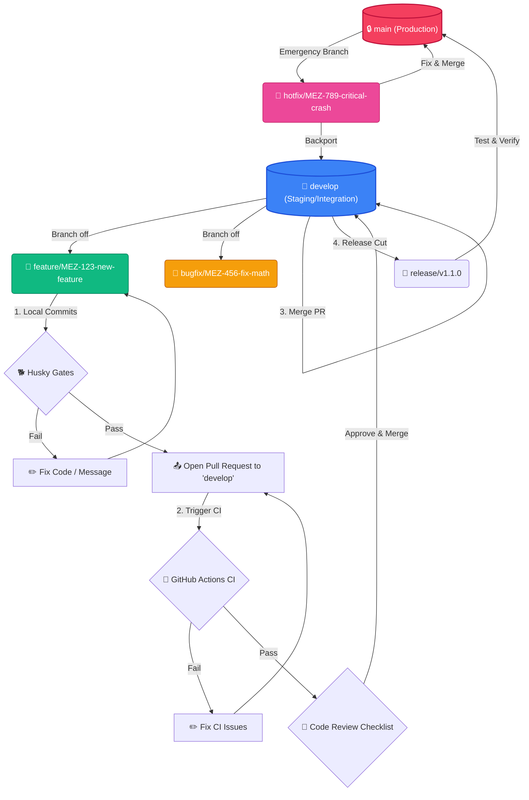

# 🤝 Contributing Guidelines

Welcome to the **Mizan Health Suite** developer documentation. We are thrilled that you want to contribute! To maintain code quality, consistency, and a reliable production application, we ask all contributors to follow the guidelines outlined below.

---

## 🔄 Git Workflow Strategy

We follow a structured branching and release workflow centered around a protected `main` branch, a staging/integration `develop` branch, and specific developer-level workflow branches.

### Branch Lifecycle & CI/CD Flow

The diagram below illustrates our Git branching model, showing how local commits go through quality gates (Husky), pull requests are built on the CI pipeline, and changes flow through staging to production.



---

## 🌿 Branch Naming Conventions

Our pre-commit hooks strictly enforce branch naming. Commits will be **automatically blocked** if your branch name does not match the following regex:

```regex
^(feature\/|bugfix\/|hotfix\/|release\/|chore\/)
```

### Supported Prefixes

| Prefix     | Use Case                                         | Example                                |
| :--------- | :----------------------------------------------- | :------------------------------------- |
| `feature/` | Developing new features or UI items.             | `feature/MEZ-101-calorie-calculator`   |
| `bugfix/`  | Fixing a bug reported in an issue or ticket.     | `bugfix/MEZ-204-fix-precision-round`   |
| `hotfix/`  | Immediate patch directly from production.        | `hotfix/MEZ-999-fix-sentry-init-crash` |
| `release/` | Preparing a new release build.                   | `release/v1.0.0`                       |
| `chore/`   | Updating documentation, CI/CD configs, or tasks. | `chore/update-contributing-guide`      |

> [!IMPORTANT]
> **Jira/Linear Ticket IDs (`MEZ-XXXX`):**
> When naming your branch, always include the ticket identifier (e.g. `MEZ-123`). The project's **`prepare-commit-msg` Husky hook** will automatically extract this ticket ID using regex and prepends it to your commit messages automatically. E.g., `feature/MEZ-123-login` will result in your commit message automatically starting with `[MEZ-123]`.

---

## 💬 Conventional Commit Guidelines

Every commit message in this project is verified against conventional commit rules using `@commitlint/config-conventional`. A commit message is structured as follows:

```text
type(scope): [TICKET-ID] short description in present tense

[optional body]

[optional footer(s)]
```

_Note: The `[TICKET-ID]` is auto-prepended by our Husky hook if your branch is named correctly (e.g., `feature/MEZ-123-math` translates your message automatically)._

### Commit Types

Our `.commitlintrc.json` permits the following standard commit types:

- **`feat`**: A new feature for the user, not a new feature for builds.
- **`fix`**: A bug fix for the user, not a fix to a build script.
- **`docs`**: Changes to the documentation (like this file).
- **`style`**: Formatting, missing semi-colons, no code changes (CSS/formatting).
- **`refactor`**: Refactoring production code (e.g., renaming a variable, extracting functions).
- **`perf`**: Code changes that improve performance.
- **`test`**: Adding missing tests, refactoring tests (no production code changes).
- **`chore`**: Updating build tasks, package manager configs, etc. (no production code changes).
- **`revert`**: Reverting a previous commit.
- **`build`**: Changes that affect the build system or external dependencies (e.g., npm packages, Next.js build setup).
- **`ci`**: Changes to our CI configuration files and scripts (e.g., GitHub Actions workflow).

### Commit Linting Rules

- **Header Max Length:** The commit header (first line) must be **200 characters or less**.
- **Case:** The header subject must be written in a consistent, descriptive sentence.

### Examples

✅ **Correct Commits:**

```bash
git commit -m "feat: add weight input boundary validation"
# Will automatically be rewritten in git history to:
# "[MEZ-123] feat: add weight input boundary validation"
```

```bash
git commit -m "chore: update prettier configs"
```

❌ **Incorrect Commits (Will be blocked):**

```bash
git commit -m "fixed bugs"                   # Missing type prefix
git commit -m "Feat: added login page"        # Capitalized Feat (must be lowercase)
git commit -m "feature: add dashboard"       # invalid type (must be 'feat' not 'feature')
```

---

## 📄 Pull Request Protocol

All contributions must go through a Pull Request (PR) targeted at the `develop` branch.

1. **Use the Template:** The PR description will automatically load from our [Pull Request Template](file:///e:/my-projects/mezan/.github/pull_request_template.md). Complete all sections.
2. **Review Requirement:** Every PR requires at least **one approved code review** from a maintainer.
3. **Green CI Status:** All checks on the GitHub Actions CI workflow must pass before the PR is eligible for merging.

---

## 👀 Code Review Checklist

Reviewers (and authors conducting self-reviews) should check the following areas before approving:

### 1. Architectural & Separation of Concerns

- Is the business logic separated from the React UI components? (e.g., math calculations in utility helper files, state management in Zustand stores, routing in page controllers).
- Are UI components modular, reusable, and responsive?
- Do changes respect the Next.js App Router route structure and routing rules?

### 2. Code Quality & Standards

- Does the code compile without any type errors (`npm run type-check`)?
- Is the file free of console logs, leftover debugging comments, or commented-out code blocks?
- Are variable and function names descriptive, matching camelCase conventions?

### 3. Stability & Edge Cases

- Are edge cases correctly handled? (e.g., input validation limits, empty arrays, null values).
- Are Next.js Error Boundaries (`error.tsx`) in place to catch crashes elegantly without causing blank screens?
- Are potential API errors or exceptions captured and reported to **Sentry** (`Sentry.captureException`)?
- Does this PR introduce any frontend exposures of private API keys/tokens? (Secrets must only live on the server, never with `NEXT_PUBLIC_` prefixes).

### 4. Tests

- Are unit tests provided for all pure utility functions and state changes?
- Are E2E tests written for new or modified user flows (Cypress)?

---

## 🛠️ Code Style & Quality Configuration

We enforce high code standards automatically. The configuration details are below:

### 1. Prettier Formatting (`.prettierrc.json`)

Prettier controls the visual look and formatting of the code:

- **Tab Width:** `2` spaces (no tabs)
- **Semicolons:** `true` (always include semicolons)
- **Quotes:** Double quotes (`"`) for strings
- **Trailing Commas:** `"es5"` compatible
- **Tailwind Support:** Integrates `prettier-plugin-tailwindcss` to automatically sort Tailwind CSS classes.

To check formatting manually:

```bash
npm run prettier:check
```

To fix formatting manually:

```bash
npm run format
```

### 2. ESLint Linting (`eslint.config.mjs`)

ESLint manages code logic correctness and quality rules using ESLint v9 Flat Config style:

- Extends `next/core-web-vitals` and `next/typescript` rules.
- Extends `eslint-config-prettier` to prevent styling conflicts.
- Applies custom overrides for test files (such as Cypress test files using `eslint-plugin-cypress` to permit global `cy` and test assertion patterns).

To run linter manually:

```bash
npm run lint
```
